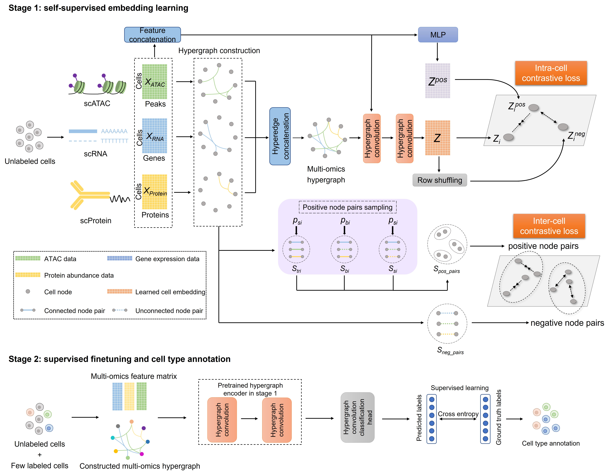

# scMHNN


### scMHNN: a novel hypergraph neural network for integrative analysis of single-cell epigenomic, transcriptomic and proteomic data 

We present scMHNN to integrate single-cell multi-omics data based on a hypergraph neural network: 

*  We generate the multi-omics hypergraph by combination of the modality-specific hyperedges to model high-order and heterogeneous data relationships. 
*  We propose a dual-contrastive loss to learn discriminative cell representation in a self-supervised manner with intra-cell and inter-cell loss together.
*  Based on the pretrained hypergraph encoder, scMHNN can achieve more accurate cell type annotation by fine-tuning in the case of only a small number of labeled cells.


<p align="center">
  
</p>


## Dependencies

scMHNN is implemented in python, the generation of simulated tri-modal dataset is implemented in R.

[](https://www.python.org/) 

[](https://github.com/pytorch/pytorch) 
[](https://github.com/theislab/scanpy) 
[](https://github.com/scikit-learn/scikit-learn)
[](https://github.com/numpy/numpy) 
[](https://github.com/pandas-dev/pandas) 
[](https://github.com/scipy/scipy) 

R depends: 

devtools

ape (5.7-1)

SymSim2 (https://github.com/PeterZZQ/Symsim2)

SymSim (https://github.com/YosefLab/SymSim)

Seurat (4.3.0)


## Usage 

Recomended usage procedure for cell representation learning and cell type annotation is as follows. 


1. Installation
(This usually takes 10 seconds on a normal desktop computer)
```
git clone https://github.com/zhanglabNKU/scMHNN.git
cd scMHNN/
```

2.  Run stage 1 (Figure 1A) for unsupervised cell representation learning.

```
python train.py 
```

After stage 1, the learned cell representation matrix (cell×embedding) and pretrained hypergraph encoder will be saved in folder './scMHNN/output/'


3. Run stage 2 (Figure 1B) to finetune scMHNN with a given ratio of labeled cells, and perform cell type annotation for remaining cells. For example, use 2% labeled cells as reference set:


```
python train.py --supervised 1 --labeled_cell_ratio 0.02 
```


Afger stage 2, the true labels and predicted labels for query set will be saved in folder './scMHNN/output/'


4. Evaluate the output results.

Evaluate the cell clustering performance:

```
python validation.py
```

Evaluate the cell type annotation performance:

```
python validation.py --supervised 1
```


## Expected output


After running the "validation.py" with supervised False, a UMAP plot showing the cluster result will be saved in folder './scMHNN/output/'

After running the "validation.py" with supervised True, a expected metric table showing the classification result will be shown like:

acc  |f1w  
-----|-----
0.861|0.863


## Simulated tri-modal dataset generation

We generate simulated tri-modal dataset by Symsim2(https://github.com/PeterZZQ/Symsim2) and Symsim. In order to generate better protein dataset, we modified Symsim reference data by PBMC protein expression fitness result which has already been included in our R scripts folders.

Symsim2 was used to generate RNA and ATAC dataset, and same phyla, cell counts, random seed and gene length were used in Symsim to generate paired protein dataset.

Step 1: 

```
cd simulation/
git pull https://github.com/PeterZZQ/Symsim2
Rscript Generate_RNA_ATAC.R (have to be in Symsim2 folder)
```

Step 2:

```
cd SymSimProtein/
Rscript SymProtein.R
```

## Arguments for scMHNN

Stage 1:

- `data_dir_rna`: path to load data RNA data.
- `data_dir_protein`: path to load data Protein data.
- `data_dir_atac`: path to load data ATAC data.
- `learning_rate`: learning rate for stage 1 in scMHNN.
- `K_neigs`: num of KNN neighbors in modality-specific graph construction.
- `p_tri`: sample probability for tri-neighbor set
- `p_bi`: sample probability for bi-neighbor set
- `positive_neighbor_num`: num of node pairs in positive neighbors set
- `drop_out`: dropout rate for stage 1 
- `n_hid`: dimension of hidden layer
- `tau`: temperature Coefficient
- `alpha`: balanced factor for dual contrastive loss


Stage 2:
- `learning_rate`: learning rate for stage 2 in scMHNN.
- `labeled_cell_ratio`: ratio of labeled reference cells


simulation
- `ngenes_list`: how many genes are simulated.
- `nregions_list`: region count of ATAC to be simulated.
- `ncells_totals`: total cell counts we simulate.
- `min_popsizes`: the least number of cells of one population.
- `phylas`: cell population relationship tree.
- `alpha_means`: drop out rate of RNA data.
- `target_props`: drop out rate of ATAC data.
- `seed`: random seed.
